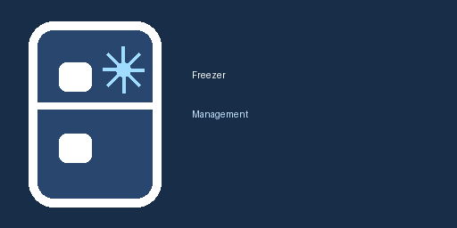

# Freezer Management



A storage-backed Home Assistant companion integration plus custom dashboard card for tracking freezer contents with **compartment-only grouping**.

This version removes the old file + notify + read-sensor chain completely. The inventory is now stored with Home Assistant's storage helper, exposed as a native sensor entity, and managed through integration services. The card reads that entity directly and writes changes through the integration.

## What changed in this generation

- Replaces file-backed JSON persistence with a companion custom integration.
- Removes the old `pot` layer from the UI and write model.
- Keeps the card focused on **contents + compartment + date**.
- Adds a Home Assistant **config flow** so the backend is created from the UI.
- Adds storage-backed services:
  - `freezer_management.add_item`
  - `freezer_management.remove_item`
  - `freezer_management.clear_inventory`
- Exposes one inventory sensor per config entry.
- Serves the custom card from the integration itself through a static URL.
- Keeps configurable table headers and the graphical card editor.

## Repository layout

```text
freezer-management-card/
  custom_components/
    freezer_management/
      __init__.py
      config_flow.py
      const.py
      diagnostics.py
      frontend/
        freezer-management-card.js
        freezer-management-resources.js
      brand/
        icon.png
        logo.png
      manifest.json
      sensor.py
      services.yaml
      storage.py
      strings.json
      translations/
        da.json
  .github/
    workflows/
      release.yml
      validate.yml
  CHANGELOG.md
  LICENSE
  README.md
  hacs.json
```

## Installation

### HACS

1. Add this repository as an **Integration** custom repository in HACS.
2. Install **Freezer Management**.
3. Restart Home Assistant.
4. Go to **Settings → Devices & services → Add integration**.
5. Add **Freezer Management** and give the inventory a name, for example `Main Freezer`.

### Dashboard resource

After the integration is installed, add the card resource once:

```yaml
resources:
  - url: /api/freezer_management/static/freezer-management-card.js
    type: module
```

You can add that in the dashboard resources UI or YAML mode.

## Card configuration

### Minimal example

```yaml
type: custom:freezer-management-card
entity: sensor.main_freezer_inventory
```

### Full example

```yaml
type: custom:freezer-management-card
title: Fryser
entity: sensor.main_freezer_inventory
sort_by: compartment
contents_header: Indhold
compartment_header: Rum
date_header: Dato
show_shortcuts: true
shortcuts:
  - Bolognese
  - Grøntsagssuppe
  - Lasagne
```

### Configuration options

| Option | Required | Description |
|---|---:|---|
| `entity` | Yes | The inventory sensor created by the integration, for example `sensor.main_freezer_inventory`. |
| `title` | No | Card title override. If omitted, the entity friendly name is used. |
| `sort_by` | No | `compartment`, `newest`, `oldest`, or `contents`. Defaults to `compartment`. |
| `contents_header` | No | Override the first table header. |
| `compartment_header` | No | Override the second table header. |
| `date_header` | No | Override the date table header. |
| `show_shortcuts` | No | Show or hide shortcut buttons. Defaults to `true`. |
| `shortcuts` | No | List of preset contents values. |

## Backend behavior

Each config entry creates one storage-backed inventory sensor.

Example entity:

```text
sensor.main_freezer_inventory
```

State:
- item count

Attributes:
- `items`
- `updated_at`

Example `items` payload:

```json
[
  {
    "id": "d1f9a3d5dca0472ba6efb8cb5cb76f0e",
    "contents": "Bolognese",
    "compartment": "2",
    "date": "2026-04-30",
    "iso_date": "2026-04-30T18:45:11.000000+00:00"
  }
]
```

## Available services

### Add item

```yaml
action: freezer_management.add_item
target:
  entity_id: sensor.main_freezer_inventory
data:
  contents: Bolognese
  compartment: "2"
```

### Remove item

```yaml
action: freezer_management.remove_item
target:
  entity_id: sensor.main_freezer_inventory
data:
  item_id: d1f9a3d5dca0472ba6efb8cb5cb76f0e
```

### Clear inventory

```yaml
action: freezer_management.clear_inventory
target:
  entity_id: sensor.main_freezer_inventory
```

## GitHub / HACS publishing notes

HACS validation also checks GitHub repository metadata, not only the files in this repository.

### Required GitHub repository topics

Set repository topics in GitHub to something like:

- `home-assistant`
- `home-assistant-integration`
- `hacs`
- `freezer-management`
- `lovelace`

### Required README image

This README includes the logo image above so the HACS README image check can pass.

### Recommended repository settings

- Add a short GitHub repository description.
- Keep Issues enabled.
- Publish real GitHub releases, not only tags.

## Future improvements

- Add edit-in-place support for existing items.
- Add expiry-date and age highlighting.
- Add optional barcode-assisted entry.
- Add an area/device style dashboard view for multiple freezer inventories.
- Split the frontend card into a standalone plugin repo if you want completely separate HACS install flows for backend and card.
- Add diagnostics export and repair flows.
- Replace the plain sensor-with-attributes model with richer entity/service patterns if you later want analytics and history views.

## Credits

- Original concept and card by Ronald Dehuysser (`rdehuyss`): https://community.home-assistant.io/t/custom-card-freezer-management/530416
- This rewritten version restructures the project into a storage-backed Home Assistant companion integration with a simplified card.
